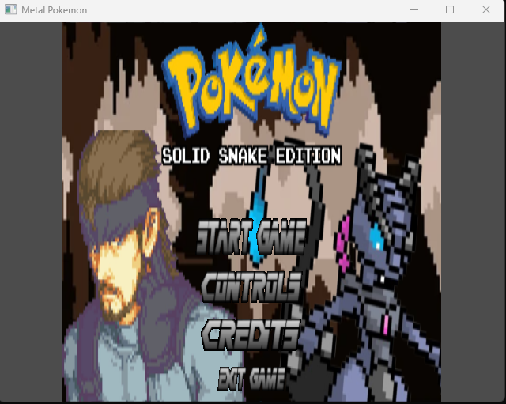
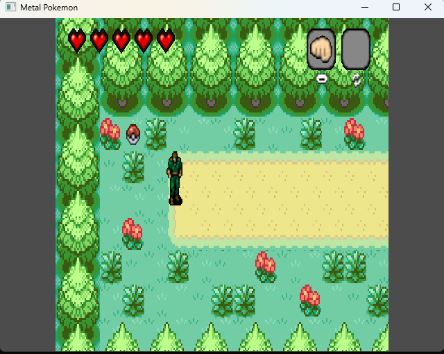
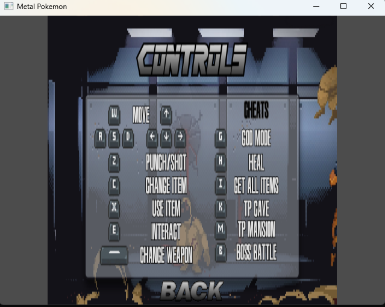
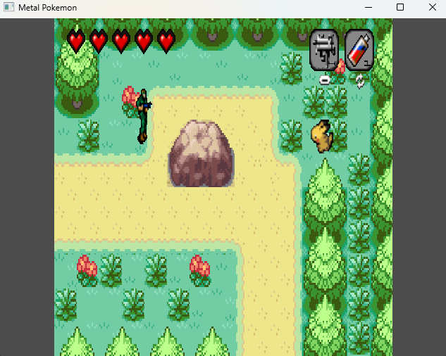
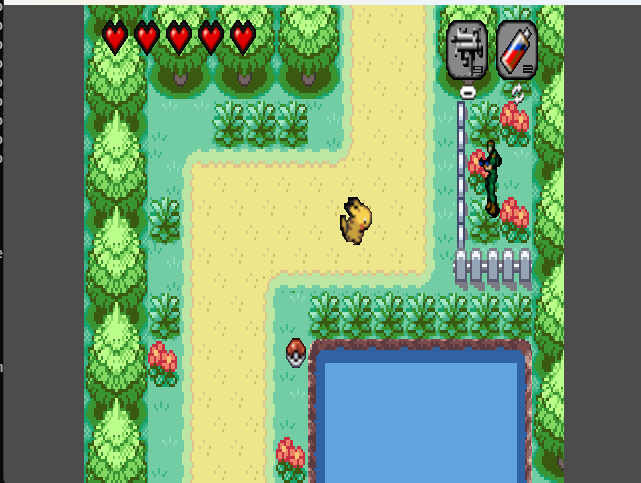
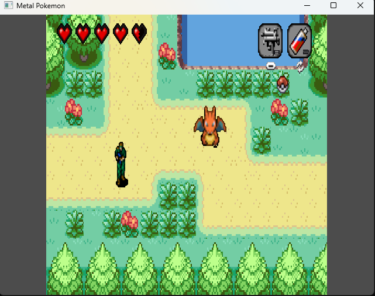
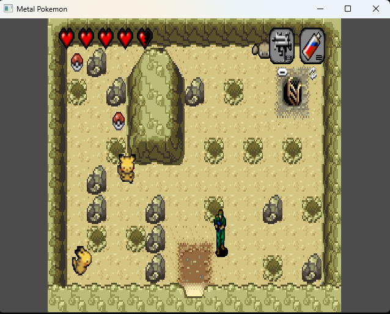
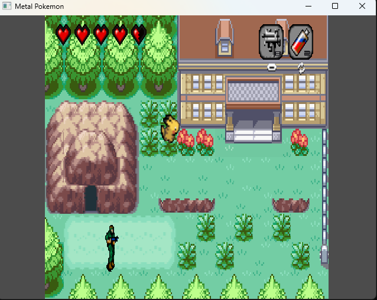
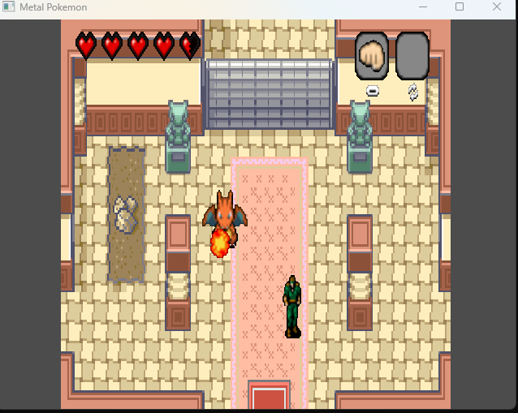
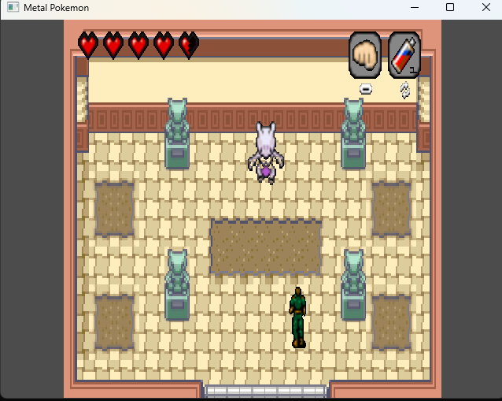

# Metal Gear

<div align="center">



**A recreation of the classic stealth infiltration game with Pokémon aesthetics**

[](LICENSE)
[]()
[]()

[Download](#installation) • [Features](#features) • [How to Play](#how-to-play) • [Gallery](#gallery)

</div>

---

## About the Project

Metal Gear is a recreation of the iconic stealth game that revolutionized the genre. This project captures the essence of the original game while incorporating a unique visual style using Pokémon tilesets, creating a distinctive aesthetic that blends tactical espionage with classic RPG visuals.

The game features 7 exterior screens and 6 interior screens distributed between a cave and a mansion, plus an additional boss arena screen, offering a complete infiltration experience.



## Features

### Core Gameplay
- **Main Menu** with Play, Instructions, and Credits options
- **Four-directional movement** for Solid Snake using WASD or arrow keys
- **Combat System**: Melee attack with Z key and ranged shooting once weapon is acquired
- **Enemy Detection System** with patrols and frontal vision mechanics

### Enemy Types
- **Pikachu** - The dog from the original game
- **Charizard** - Ranged enemy
- **Geodude** - Basic robust enemy

### Health and Items System
- Health system for both Snake and enemies
- **Collectible Items**: 
  - Weapon (equipable)
  - Isotonic drink / Medpack (consumable)
  - Ammunition (consumable)
  - Key (equipable)
- All entities have full interactivity
- Item switching with C key and use with X key
- Weapon reload: select bullets with C and consume with X

### Level Design
- **7 exterior screens**
- **6 interior screens** (cave and mansion)
- **1 boss arena**
- Smooth transitions between areas

### Boss Fight
- Final boss with unique mechanics
- Button collection required to open boss door

### Interface and Audio
- Graphical interface showing health and equipped items
- Background music and special sound effects
- Smooth animations and state transitions

### Debug/Test Functions
- God Mode (G)
- Heal (H)
- Get All Items (I)
- Teleport to Cave Interior (K)
- Teleport to Mansion Interior (M)
- Teleport to Boss (B)

### Game Over System
- Game Over screen when Snake loses all health
- Options to restart or return to main menu

## Installation

### Quick Start

1. **Clone this repository**
   ```bash
   git clone https://github.com/inkih04/MetalGear.git
   cd MetalGear
   ```

2. **Navigate to the Play folder**
   ```bash
   cd Play
   ```

3. **Run the game**
   - Double click on `Game.exe`
   - Start playing

### Project Structure

```
MetalGear/
│
├── Play/                  # EVERYTHING YOU NEED IS HERE
│   ├── Game.exe          # Main game executable
│   ├── *.dll             # Required dynamic libraries
│   ├── assets/           # Game resources (graphics, sounds)
│   └── data/             # Configuration data
│
├── img/                   # Screenshots for README
├── src/                   # Source code
├── libs/                  # Development libraries
├── docs/                  # Documentation
├── .gitignore            # Git ignore rules
└── README.md             # This file
```

> **IMPORTANT:** All files necessary to run the game are located in the **`Play`** folder. This includes the executable (`Game.exe`) and all required DLL files. Simply execute **`Game.exe`** to start playing - no additional installation required.

## Art Style

This project features a distinctive visual approach by utilizing **Pokémon tilesets** for its graphics. This design choice creates a unique fusion between the tactical stealth gameplay of Metal Gear and the classic aesthetic of Pokémon games, resulting in a charming yet functional visual experience.

## How to Play

### Controls



| Action | Key |
|--------|-----|
| Movement | WASD or Arrow Keys |
| Melee Attack | `Z` |
| Switch Item | `C` |
| Use/Equip Item | `X` |
| Pause/Menu | `ESC` |

**Menu Navigation**: Use mouse to navigate through menu options

### Gameplay Instructions

1. **Movement**: Navigate through the levels using WASD or arrow keys
2. **Stealth**: Avoid being detected by enemies or they will chase you
3. **Combat**: 
   - Use Z for melee attacks
   - Collect the weapon to enable ranged combat
   - Load the pistol by selecting bullets with C and consuming them with X
4. **Items**: Collect items to improve your equipment or recover health
5. **Boss Access**: Collect the button to open the door to the boss fight
6. **Victory**: Defeat the final boss to complete the mission
7. **Pause**: Press ESC to pause the game and return to main menu

### Gameplay Tips

- **Stay undetected** - Enemies have frontal vision and patrol patterns
- **Manage your resources** - Ammunition and health items are limited
- **Explore thoroughly** - Items are scattered throughout the levels
- **Learn enemy patterns** - Each enemy type has different behaviors
- **Use melee wisely** - Save ammunition for critical situations

## Gallery

### Main Menu & Start Screen

<div align="center">


*Main Menu*


*Game Start*

</div>

### Level Exploration

<div align="center">


*Exterior Area 1*


*Exterior Area 2*


*Interior Cave*


*Mansion Entrance*


*Interior Mansion*


*Advanced Area*

</div>

### Boss Fight

<div align="center">


*Final Boss Arena*

</div>

### Controls Reference

<div align="center">


*In-game Controls*

</div>

## System Requirements

| Component | Minimum | Recommended |
|-----------|---------|-------------|
| **OS** | Windows 7 | Windows 10/11 |
| **Processor** | Intel Core i3 | Intel Core i5 or higher |
| **RAM** | 2 GB | 4 GB |
| **Graphics** | Integrated | Dedicated |
| **Storage** | 500 MB | 1 GB |
| **DirectX** | Version 9.0c | Version 11 |

## Troubleshooting

### Game won't start
- Ensure DirectX and Visual C++ Redistributables are installed
- Run `Game.exe` as administrator
- Check that all DLL files are present in the Play folder

### Performance issues
- Close background applications
- Update your graphics drivers
- Disable unnecessary visual effects in Windows

### No audio
- Verify speakers/headphones are connected
- Check Windows audio settings
- Ensure audio drivers are up to date

### Controls not responding
- Check keyboard layout settings
- Ensure no other application is capturing keyboard input
- Try running the game in compatibility mode

## Contributing

Contributions are welcome. If you want to improve the project:

1. Fork the repository
2. Create a feature branch (`git checkout -b feature/NewFeature`)
3. Commit your changes (`git commit -m 'Add NewFeature'`)
4. Push to the branch (`git push origin feature/NewFeature`)
5. Open a Pull Request

## License

This project is licensed under the MIT License. See the `LICENSE` file for details.

## Authors

**Víctor Díez Serrano (inkih04)**
- GitHub: [@inkih04](https://github.com/inkih04)

**David Mas Escudé (PatoPro121)**
- GitHub: [@PatoPro121](https://github.com/PatoPro121)

## Acknowledgments

- Hideo Kojima for creating the original Metal Gear franchise
- Nintendo and Game Freak for the Pokémon visual assets used in this project
- The indie developer community
- All testers and contributors

---

<div align="center">

**Enjoyed the project? Give it a ⭐ on GitHub**

Made with passion by [Víctor Díez Serrano](https://github.com/inkih04) and [David Mas Escudé](https://github.com/PatoPro121)

</div>
